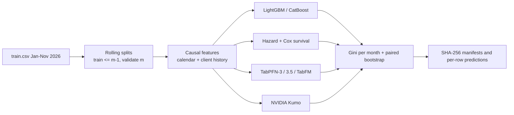

# Datafest: Customer Conversion Propensity

Leakage-safe, auditable modeling of which clients convert next month, evaluated with a rolling-origin protocol on a competition dataset (110,100 client-month rows).

Versión en español: [README.es.md](README.es.md)

> Team project. The pipeline, experiments and documentation were written mainly by [@nakato156](https://github.com/nakato156); see [Credits](#credits).

## Problem

The competition, run for a financial entity, provides one row per client per month. `objetivo = 1` means the client converted for the first time that month; after converting the client no longer appears. The goal is to rank the 9,900 December 2026 clients by propensity to convert. The competition metric is Gini = 2 x ROC AUC - 1.

## Approach



- **Folds:** train up to August and validate September; up to September and validate October; up to October and validate November. October and November are never used to search hyperparameters or for early stopping, and December is kept separate for the final submission.
- **Features:** the original client columns; the month as `YYYYMM` or `month_index`; five causal client-history features (`n_observaciones_previas`, `mes_primera_aparicion`, `meses_desde_entrada`, `meses_en_riesgo`, `cliente_recurrente`). The raw `id_cliente` is excluded: it did not pass the project's group-split safety gates (see `NON_NEGOTIABLE.md` and `experiments/`).
- **Auditability:** each run stores its configuration, SHA-256 hashes of sources, splits, features, model and outputs, and row-level predictions so metrics can be recomputed. The repository includes 27 pytest tests covering temporal causality, data contracts, metrics and lineage.

## Results

Rolling Gini per validation month (source: `experiments/diagnostics/results.md`):

| Model | Sep | Oct | Nov | Mean |
| --- | ---: | ---: | ---: | ---: |
| LightGBM D (base + history + month) | 0.2434 | 0.2677 | 0.2420 | **0.2510** |
| CatBoost A (base) | 0.2471 | 0.2651 | 0.2357 | 0.2493 |
| LightGBM B (base + month) | 0.2419 | 0.2704 | 0.2337 | 0.2487 |
| TabPFN-3 | 0.2365 | 0.2432 | 0.2235 | 0.2344 |
| Cox start-stop | 0.2312 | 0.2392 | 0.2018 | 0.2241 |
| Hazard (cloglog) | 0.2297 | 0.2388 | 0.2014 | 0.2233 |
| TabPFN-3.5 | 0.1633 | 0.1698 | 0.1378 | 0.1570 |
| TabFM | 0.1564 | 0.1461 | 0.1526 | 0.1517 |

A paired client-level bootstrap (2,000 resamples, Holm-adjusted) shows that every confidence interval for the LightGBM D / LightGBM B / CatBoost A differences includes zero, so no model is a statistically conclusive winner. An exploratory 50/50 blend of LightGBM D and NVIDIA Kumo reached a mean Gini of 0.2542; its paired bootstrap is still pending (`experiments/kumo/`). The repository is best read as a rigorous methodology and experiment-tracking case study rather than a "best model" claim. Further detail: `experiments/EXPERIMENT_SUMMARY.md`.

## Tech stack

Python 3.12, uv, LightGBM, CatBoost, scikit-learn, pandas, SciPy, pytest; optional TabPFN, NVIDIA structured-data-models (Kumo) and Google Colab (T4 GPU) for the foundation-model runs.

## How to run

```bash
uv sync
uv run pytest -q
uv run datafest verify --manifest <path-to-run>/manifest.json
```

Kumo evaluation (GPU, run on Colab T4 in the recorded experiments):

```bash
uv sync --extra kumo
uv run --extra kumo datafest-kumo --run-id <run_id> --max-context-limit 60000 --sizes medium large
```

TabPFN foundation runs need a `TABPFN_TOKEN` in your environment or in a git-ignored `.env`; never commit it.

## Project structure

```
src/datafest/       pipeline, splitting, features, models, survival, foundation, kumo, metrics, lineage
scripts/            Colab runners, fold recovery, report generation
tests/              temporal causality, data contracts, metrics and lineage
experiments/        runs, manifests, predictions, reports
data/               competition files and derived splits
NON_NEGOTIABLE.md   frozen evaluation rules (Spanish)
```

## Credits

- [@nakato156](https://github.com/nakato156): pipeline, experiments and documentation (9 of the 10 commits).
- [@Jaed69](https://github.com/Jaed69) (Jhamil Peña): team member; added the competition dataset and description to the repository.

Competition data belongs to the organizer.

## License

No license file is included in this repository.
